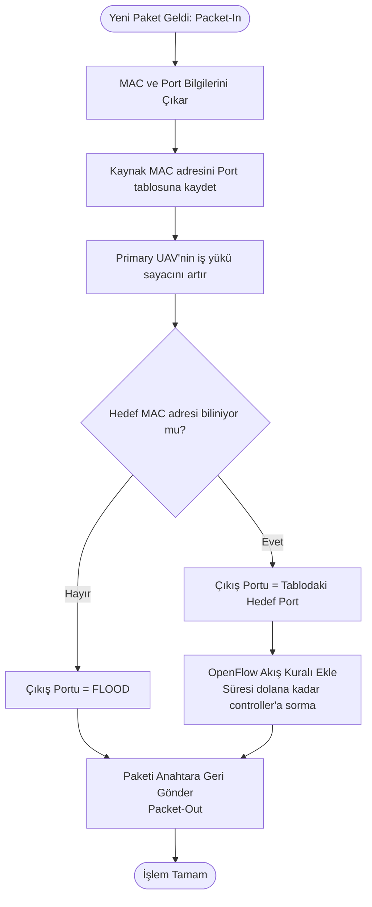

# SDN Kontrollü FANET Projesi Akış Diyagramları

Bu dosyada, `tez_controller.py` içerisinde tasarladığımız dinamik çoklu UAV (Primary/Backup) SDN yönlendirme algoritmasının akış diyagramları bulunmaktadır. Raporunuza veya sunumunuza ekleyebilirsiniz.

## 1. Periyodik Durum İzleme ve Yönlendirme Algoritması (Monitor Thread)

Ağ durumunu düzenli olarak kontrol eden ve ana/yedek UAV kararını veren ana döngü.

```mermaid
graph TD
    A[Başla: _monitor thread] --> B[UAV Durum Kontrolü<br>AP'ye uzaklık < max_mesafe mi?]
    B --> C[Enerji Modelini Güncelle<br>Primary/Backup rollerine göre tüketim]
    C --> D[Yük Modelini Güncelle<br>İşlenen paket sayısına göre]
    D --> E{Aktif UAV Var mı?}
    E -- Yok --> F[Tüm UGV'ler için 'Bağlantı Yok'<br>durumuna geç]
    E -- Var --> G[Her UAV için Skor Hesapla<br>w1*Mesafe + w2*EnerjiKayıp + w3*Yük]
    G --> H[Skorlara Göre Sırala<br>En küçük skor = En iyi]
    H --> I[Primary ve Backup UAV Seçimi]
    I --> J{Primary Değişti mi?}
    J -- Evet --> K[Failover (Hata Devretme) Kaydet<br>Yönlendirme Tablosunu Güncelle]
    J -- Hayır --> L[Yönlendirme Tablosunu Güncelle]
    F --> M
    K --> M
    L --> M
    M[2 Saniye Bekle] --> B
```

## 2. Paket İşleme ve Öğrenme Algoritması (Packet-In Handler)

Ağdaki anahtarlardan SDN kontrolcüsüne yeni bir paket geldiğinde izlenen yol.



## 3. UAV Skorlama Matematiği
Seçim esnasında kullanılan skor fonksiyonu mantığı (Küçük değer tercih edilir):

$$ Score = (W_{mesafe} \times Norm(Mesafe)) + (W_{enerji} \times (1 - Enerji)) + (W_{yuk} \times Yuk) $$
